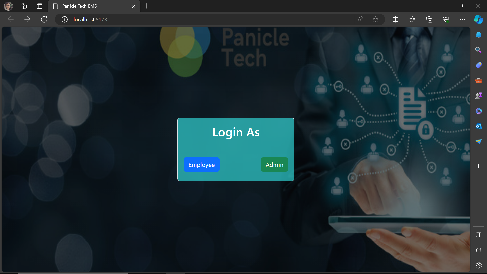

# Employee-Management-System-Assignment 
 
Objective:
 
Develop a comprehensive web application using ReactJS and NodeJS that allows users to manage company employee data. The application should offer CRUD functionality for employee records and utilize data visualization through charts, user-friendly forms for data entry and editing, and informative cards for individual employee data display.
The first two folders you see (Front-end and Server) these are the older version of employee management system project.

## Screenshots  
### 1 Selection Page (Employee OR Admin)
